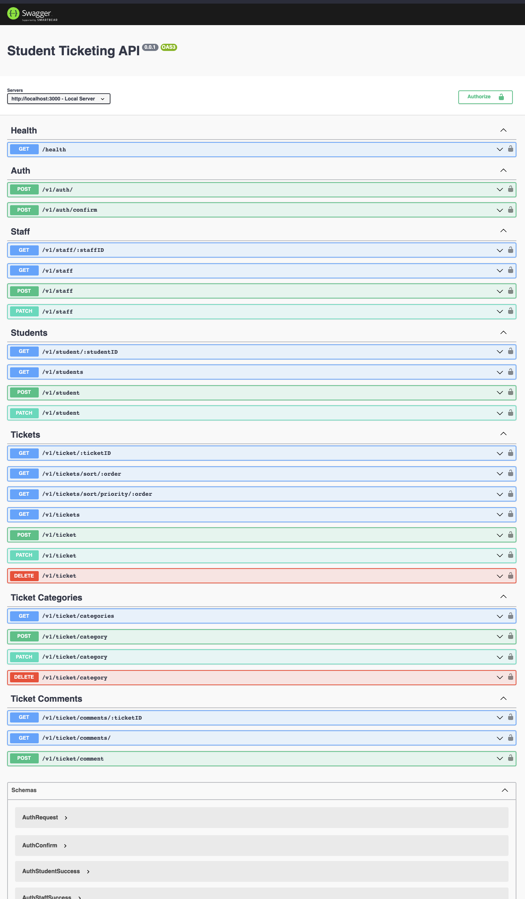

# Student Ticketing API
***
A demonstration utilizing `OTP/JWTs` + `Node/Express` + `Swagger/ESDocs` + `Sequelize/Migrations (PostgreSQL)`

## Example


## Features

- Students should be able to create a ticket in order to contact the housing management.
- Students should be able to specify the subject line for their request.
- Students should be able to categorize their type of issue (accounting, maintenance, leaks, utilities, etc.)
- Students should be able to specify the priority of their issue.
- Students should be able to specify an optional location for their issue.
- Each student should have a room number, bed number, and building associated to their id.
- Students should be able to reply to their own ticket request.
- Students should be able to view all of their previous tickets.
- All staff members should be able to view all tickets submitted to the system.
- All staff members should be able to reply to each ticket request.
- All staff members should be able to close a request and mark it as either fixed or not.
- Only admins should be able to delete a request.
- All staff members should be able to sort the tickets in order of priority.
- All staff members should be able to overwrite the priority of the ticket.
###

## Boilerplate Extras

- `AirBNB Eslint`
- `c8` test coverage w/ `Mocha` testing
- Public-facing `Swagger` API Docs
- Internal docs generated by `ESDoc`
- `Winston` logger
###
## Future Improvements

- Middleware to prevent posting duplicates
- Middleware to force api rate limiting
- Finish OTP implementations
- File upload via S3 / Imgix / etc
- Migration to add `attachmentSrc` to `TicketComments`
- Improve Test Coverage %
###
***

## Required
- PostgreSQL
- If using the `npm run dev` command, installing `nodemon` globally is also required using:

  ```sh
  npm i -g nodemon
  ```


## Getting Started

Download or clone the repo using the following command:

```sh
git clone git@github.com:ustincameron/student-ticketing-api.git
```

- Open project folder
- Install dependencies

  ```sh
  npm install
  ```

- Rename `.env.example` file to `.env` and update the values within
- Create a Database within Postgres to match `DB_NAME` inside `.env`
- Start app:

  ```sh
  npm run start
  ```
  or 
  ```sh
  npm run dev
  ```
  *(`dev` utilizes `nodemon` to hot-reload any changes)*

## Tests & Coverage

- Run tests *(unit/integration)*

  ```sh
  npm test
  ```

- Run tests with coverage

  ```sh
  npm run coverage
  ```

## Migrations

- Running Migrations

  ```sh
  npm run migration
  ```

- Undoing Migrations

  ```sh
  npm run migration:undo
  ```

Thanks to [Chetan07j](https://github.com/Chetan07j) for the initial boiletplate.
